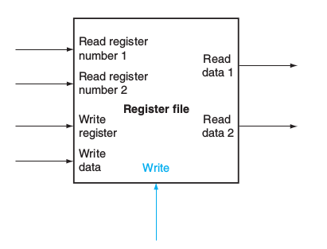

# riscv-core
A customized RISCV core made using verilog

## Verilog Codes for RISCV blocks:

1. **Register File**:

    

Verilog Code: [Register File](https://github.com/ombhilare999/riscv-core/blob/master/src/register_file.v)

TO DO:
1. Hardcore zero register
2. Add reset and logic to avoid writing in zeroth register.

