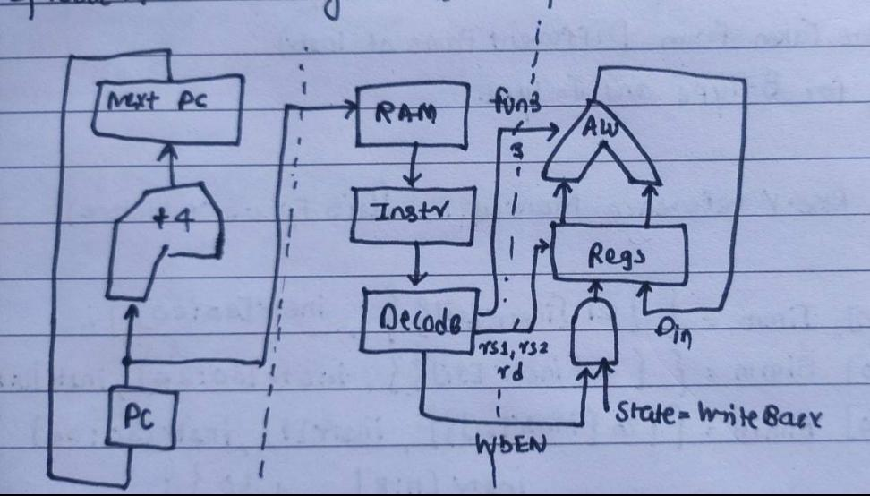
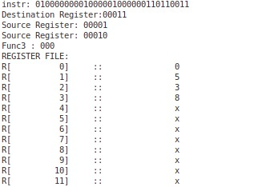

# riscv-core
A customized RISC-V core made using Verilog

<!-- Progress -->
## Progress
- [x] R-Type Instructions
- [x] I-Type Instructions
- [ ] Branch Instructions
- [ ] LUI, AUIPC, JAL, JALR
- [ ] Load and Store Instructions

## RISC-V Core:

1. **R - Type Instruction Datapath**:
    - Datapath:

    

        
    

    - Output:

    

        
    

