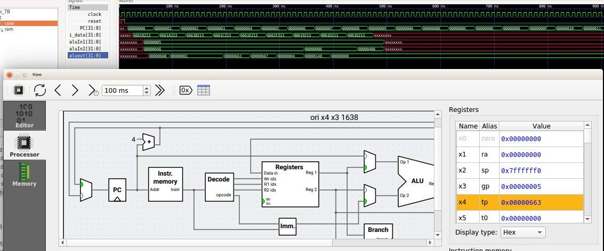

    .
    ├── disassemble.sh      //Script to disassemble the code
    ├── disassemble.txt     //Binary dumped into this text file
    ├── isa_test.o          //Object File of assembly file
    ├── isa_test.S          //Assembly code in isa_test.S

- How to (disassemble) Convert the RISC-V assembly code to Binary

```bash
    chmod +x disassemble.sh
    ./disassemble.sh
```

- For emulating the code I'm using ripe software: [Ripes](https://github.com/mortbopet/Ripes.git)

(Ripes is a visual computer architecture simulator and assembly code editor built for the RISC-V instruction set architecture.)

   <p align="center">
        
    </p>


